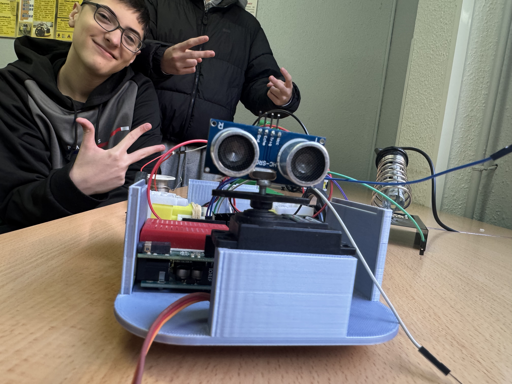
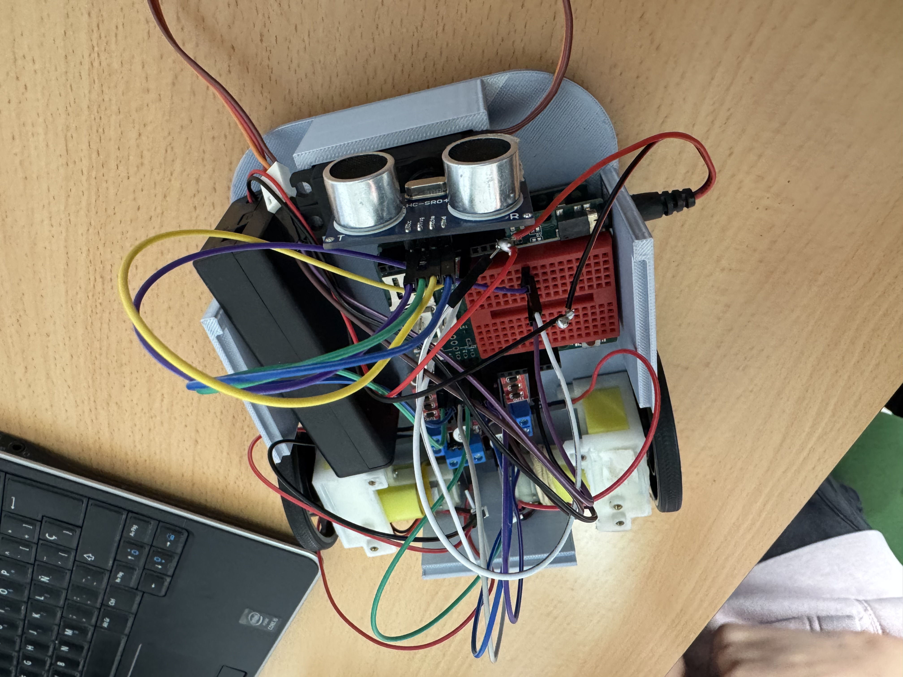
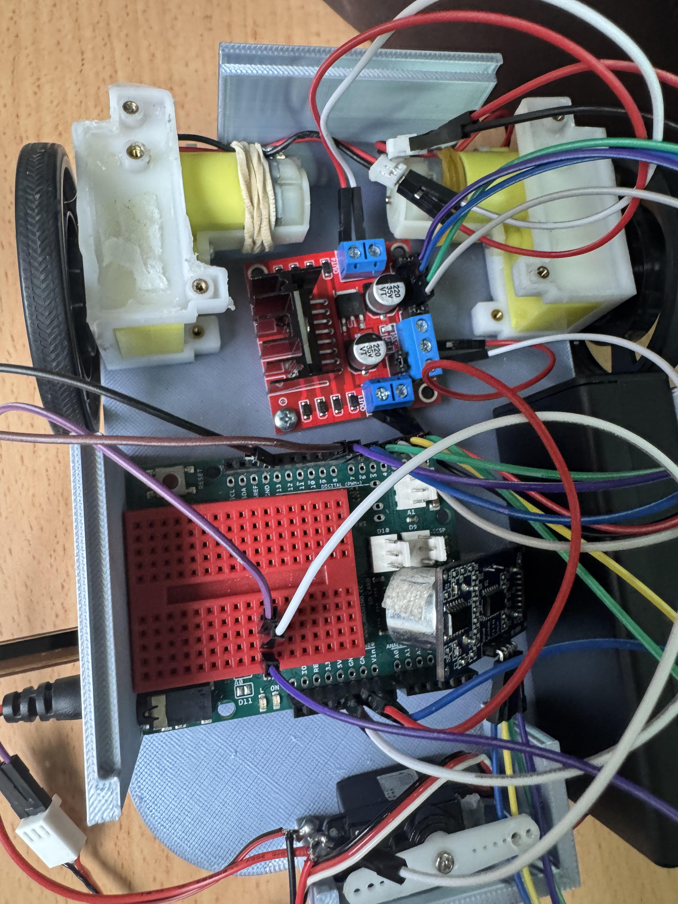

# FOTO DE COMO QUEDARIA MI ROBOT DEL PROYECTO.

## EXPLICACION DEL PROYECTO EN CUESTION.
Lo que vamos ha hacer en este poyecto es hacer un vehiculo impreso en 3D. El objetivo principal es gracias a la placa arduino meterlo codigo para que el vehiculo pueda escapar de un laberinto que día a día sera distinto haciendo que el robot pueda salir dando igual de que forma este hecha el laberinto.

## ¿QUE MATERIALES USA?
Los materiales que usa son los siguientes:

-2 motores de corriente continua con reductora

-1 placa arduino

-1 ultrasonidos

-1 pollito

-1 escudo L298N

-2 baterias 3,7V 18650

-1 chasis

# RESULTADO DE COMO QUEDARIA EL ROBOT CON SUS PIEZAS.
|           PARTE UNO DEL DISEÑO DEL ROBOT DES EL ENFRENTE    |        PARTE DOS DEL DISEÑO DEL ROBOT DESDE ARRIBA            |      
|--------------------------------------------------------------|--------------------------------------------------------------|
|||

## ¿COMO LO HEMOS HECHO?
## Para hacer el robot lo hemos echo en varios pasos:

## 1. Atornillar las placas a la base del robot

Para ello, lo que hemos hecho ha sido medir cuánto mide, por ejemplo, la placa Arduino y luego medir la base para saber dónde colocarla y cómo hacerlo. De esta manera, a la hora de atornillarla no tendremos problemas con las demás piezas que también hay que fijar, como el escudo y los motores.
-----------------------------------------------------------------------------------------------------------------------------------------
## 2. El cableado

Esta es la parte más estresante, sin ninguna duda, por la cantidad de cables que hay en un espacio tan reducido. Pero bueno, lo primero es saber qué cables necesitamos. Para ello, solo necesitamos cables macho-macho y macho-hembra. Aproximadamente, usamos unos 9 cables macho-hembra y 6 macho-macho.
Una vez que tengamos los cables, habría que unirlos con las partes correspondientes. Lo primero que hay que hacer es conectar los 6 cables macho-macho al escudo, de forma que queden bien fijados (los ponemos en el escudo para poder controlar y programar los motores más tarde). Después, conectamos los cables macho-hembra que quedan entre el escudo y la placa Arduino que atornillamos antes.
-------------------------------------------------------------------------------------------------------------------------------------------
## 3. La programación

Es un proceso que aún no hemos hecho, pero estamos en ello. La idea que tenemos es que el robot, utilizando un solo sensor ultrasónico (aunque en un principio pensábamos usar 3), pueda, con la ayuda de un servomotor, hacer que el sensor gire 180 grados. Así, el robot podrá detectar obstáculos e intentar recorrer un laberinto sin chocar.
-------------------------------------------------------------------------------------------------------------------------------------------
(corregido por chatGPT)
## ¿CUAL ES EL FIN DE TODO ESTO?
El fin de todo esto es construir programar y hacer que aprenda ha hacer  que el robot pueda pasar or un laberito que cambia y se hace más dificil cada día que pase y lo que tiene que hacer el robot es conseguir que pase el laberinto sin chocarse ninguna vez.
## ¿QUE OBJETOS HEMOS UTILIZADO?
-2 Motor: esto lo que hace es darle la movlidad al robot que para ello hemos tenido que atornillar a la base no sin antes medir el espacio que tiene  para que ocupe el minimo espacio posible antes de colocarlo y atornillarlo.
-1 Escudo: esto lo que hace es que la programacion que le demos al robot se la pase al escudo y del escudo al motor para darle movilidad.
-1 Placa arduino:esto sirve para que se pueda programar para que haga todas las funciones que he mencionado arriba que luego pasara una vez terminado la programacion pase al escudo y del escudo a los motores

## FOTO+VIDEO DEL ROBOT SEMI MONTADO
|        PARTE DOS DEL DISEÑO DEL ROBOT DESDE ARRIBA           |                  VIDEO DEL ROBOT                             |
|--------------------------------------------------------------|--------------------------------------------------------------|
|    |                                                              |

# RETOS

